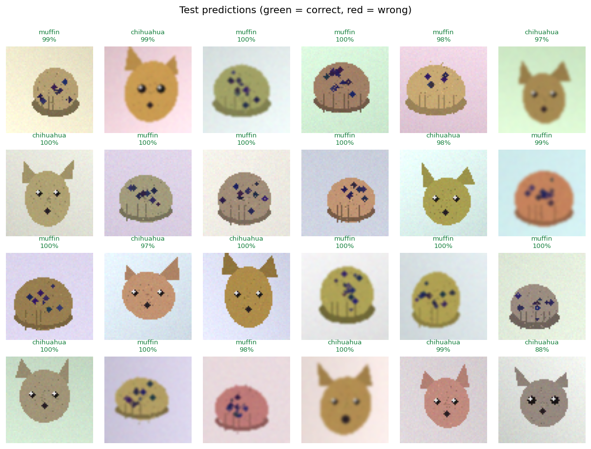
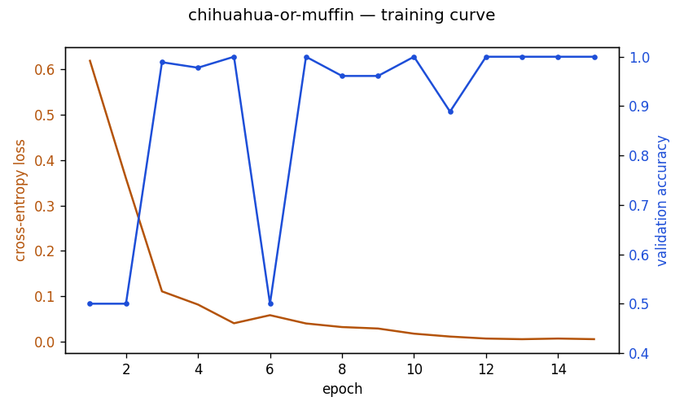

# Chihuahua or Muffin?

A small convolutional neural network that learns the classic *fine-grained*
vision problem: telling two near-identical round-brown-blob classes apart.
Trained end to end on CPU with PyTorch.

- **Live site:** https://andreaisabelmontana.github.io/chihuahua-or-muffin/
- **Held-out test accuracy:** **99.4%** (179 / 180), vs a 50% chance baseline.

> **About the data — read this.** This project does **not** use the real
> internet-meme photographs. It uses a **procedurally rendered** 2-class
> dataset (numpy + OpenCV) that deliberately recreates the meme's difficulty:
> both classes are a round tan/brown blob with small dark dots, so colour
> alone gives nothing away and the network is forced to learn structure.
> See [the dataset section](#the-dataset) for exactly what the images are.



## The model

`TinyCNN` (in [`chm/model.py`](chm/model.py)) — ~25.8k parameters:

```
input 3×64×64
 ├─ conv3×3(3→16)  + BN + ReLU + maxpool2   → 16×32×32
 ├─ conv3×3(16→32) + BN + ReLU + maxpool2   → 32×16×16
 ├─ conv3×3(32→64) + BN + ReLU + maxpool2   → 64×8×8
 ├─ global average pool                      → 64
 └─ dropout → linear(64→32) → ReLU → linear(32→2)  → 2 logits
```

Trained with Adam (lr 2e-3, weight-decay 1e-4), cross-entropy loss, light
train-time augmentation (horizontal flip, brightness jitter, additive noise).
Best-on-validation weights are restored before the final test evaluation.

## The dataset

Generated by [`data/generate.py`](data/generate.py) — **not** real photos.
Each image is a 64×64 render:

| class       | what's drawn |
|-------------|--------------|
| `chihuahua` | a tan/brown head blob with **two triangular ears**, **two symmetric eyes** and a **nose**, plus fine fur speckle |
| `muffin`    | a tan/brown **domed muffin-top** with a fluted rim, vertical flute lines and **scattered blueberry specks** (no ears, no symmetric face) |

Every image randomises position, scale, rotation, blob colour, dot
count/placement, lighting gradient and sensor noise, so there is genuine
intra-class variation and no two images are alike. Crucially the two classes
have **near-identical mean brightness** (≈192.7 vs ≈193.4 over 40 samples), so
the only reliable signal is *shape and layout* — exactly the fine-grained cue
the meme is about. The model sits at chance (0.50) for the first ~2 epochs and
only climbs once it learns these structural features (see the curve below).

Default size: 600 images/class → 840 train / 180 val / 180 test (70/15/15),
class-balanced.

## Results (real run)

From [`results.json`](results.json), one full `python train.py` run on CPU:

| metric | value |
|--------|-------|
| held-out **test accuracy** | **0.994** (179/180) |
| best validation accuracy | 1.000 |
| chance baseline | 0.500 |
| confusion (rows=true, cols=pred) | chihuahua `[89, 1]` · muffin `[0, 90]` |
| parameters | 25,842 |
| training time | ~39 s (15 epochs, CPU) |



## Quick start

```bash
pip install -r requirements.txt
# (torch CPU wheel: pip install torch torchvision --index-url https://download.pytorch.org/whl/cpu)

python -m data.generate     # render data/dataset/{train,val,test}  (train.py also does this if missing)
python train.py             # train, save model + figures + results.json
python predict.py path/to/image.png
```

`predict.py` prints the predicted label and class probabilities:

```json
{ "label": "muffin", "prob": 0.9998,
  "probabilities": { "chihuahua": 0.0002, "muffin": 0.9998 } }
```

## Tests

```bash
python -m pytest -q
```

Covers: conv/forward output shapes, a `torch.autograd.gradcheck` on a tiny
conv+dense stack (backprop correctness), generator determinism + intra-class
variation + the near-equal-brightness property, that a freshly trained model
**beats 50% chance by a clear margin** on a held-out split, and that
`predict.py` returns a valid label and probability distribution. 15 tests.

## Layout

```
data/generate.py   procedural dataset generator (the honest synthetic data)
chm/model.py       TinyCNN architecture
chm/data.py        image loading / preprocessing / augmentation
train.py           train + evaluate + save model/figures/results.json
predict.py         classify a single image file
tests/             pytest suite
```

## License

MIT — see [LICENSE](LICENSE).
